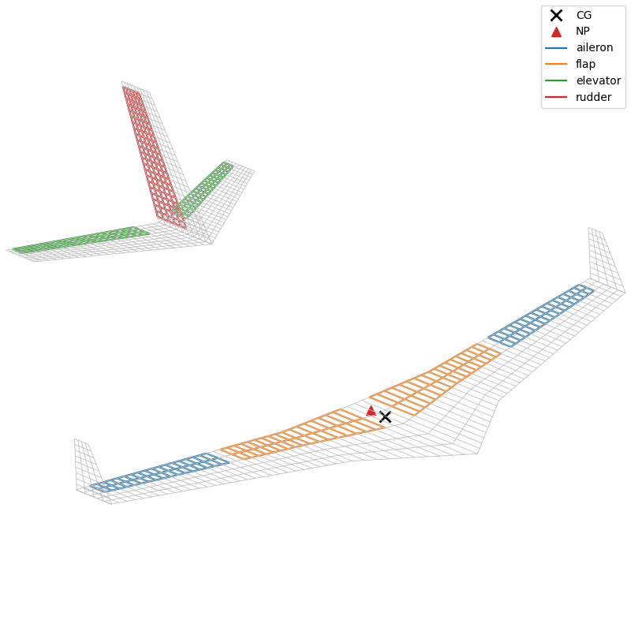
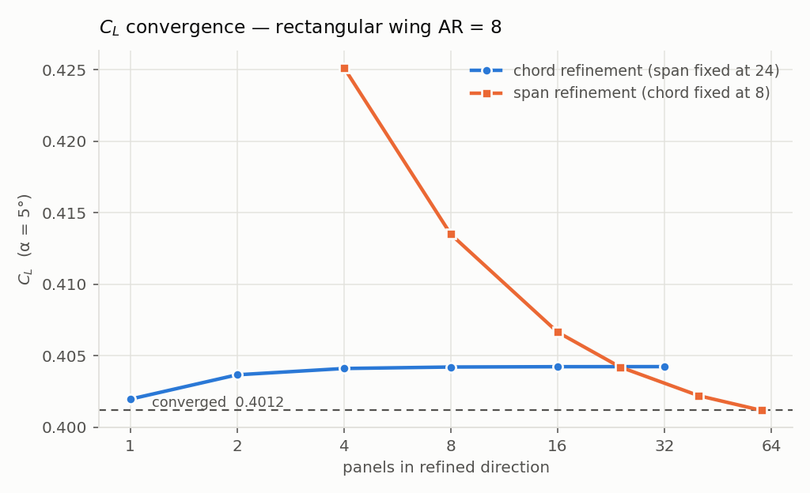
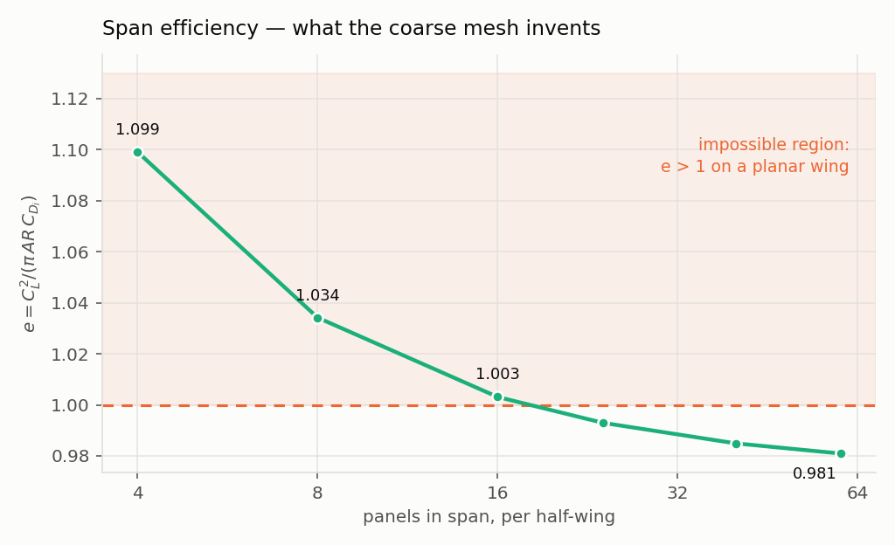
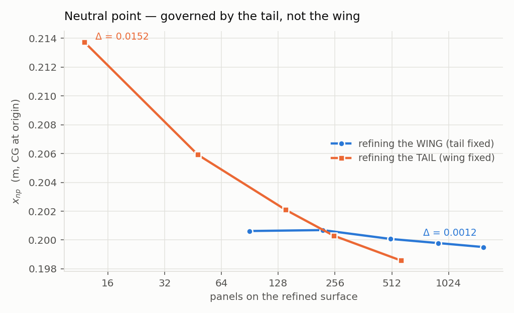
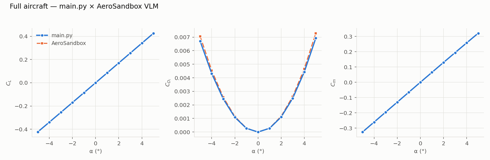
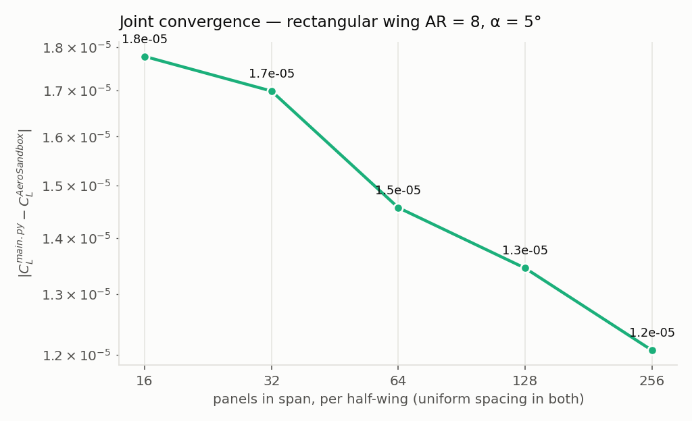
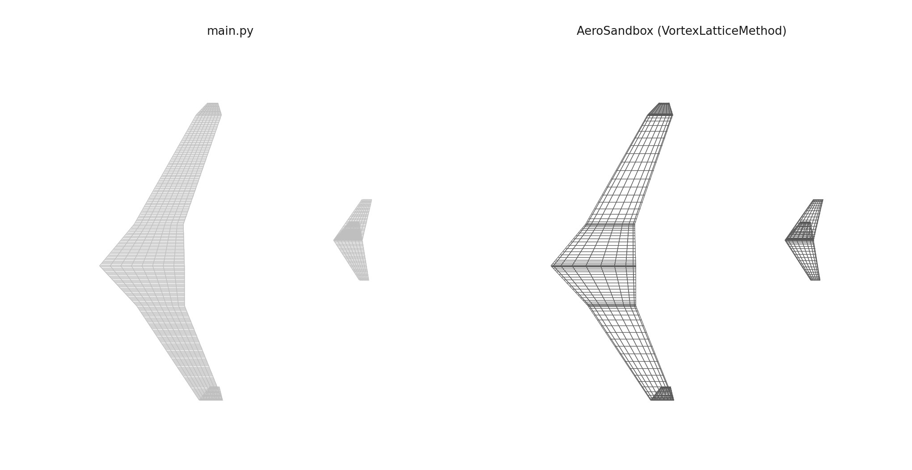
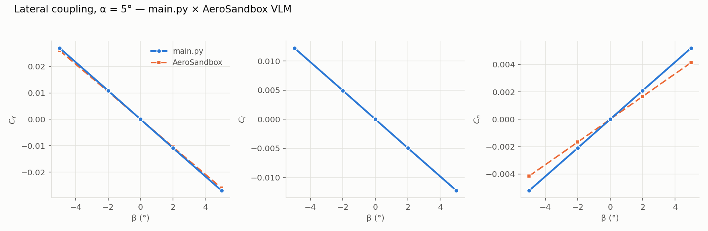

# Vortex Lattice Method implementation

A study focused on implementing a clear and instructive program to compute VLM for simple yet generic aerodynamic configurations.



## Context

The current implementation is based on the book Flight Vehicle Aerodynamics, by Mark Drela, on section 6.5.

The code consists of a potential method for solving 3D flows, optionally coupled to 2D viscous section data from XFOIL. It can be very useful for configuration analysis, load estimation, trim conditions, stability and control derivatives.

The geometry of the configuration is highly simplified, any volumes of the geometry and its effects are ignored. The lattice itself is a flat plate: the only geometric effect it carries is control-surface deflection, achieved by the rotation of the surface normals. Section properties — camber, thickness, profile drag — enter only through the viscous coupling described below, which is why the lattice needs no camber model of its own.

The current implementation uses the JAX library as its numerical engine. This choice was made to make use of Automatic Differentiation, which could be useful in trade and optimization studies and is used for calculation of control derivatives. JAX also allows the user to specify which hardware the program runs on, either the CPU, the GPU, or even the TPU if available, and offers a series of function transformations that are useful for parallel computation and vectorization.

## Installing

The inviscid solver needs only three packages:

```bash
pip install jax numpy matplotlib
```

The viscous coupling adds XFOIL, which ships as a Fortran extension and is compiled at
install time, so it needs a toolchain:

```bash
sudo apt install gfortran cmake make        # Debian/Ubuntu
pip install -r requirements.txt
```

`requirements.txt` takes XFOIL from the upstream GitHub tag, not from PyPI: the PyPI sdist
of 1.1.1 no longer builds against modern setuptools.


### A note on non-converged points

`XFoil.aseq` reports a non-converged angle by writing `NaN` into the **angle** array, not
only into the coefficients. `generatePolars` therefore rebuilds the angle sequence itself
(`alphaSequence`) rather than trusting what comes back, and `trimPolar` bridges short gaps
before interpolating.

## Theory

The VLM approach simplifies each lifting surface into a vortex sheet, and each vortex sheet is split into panels. Each panel has a horse-shoe vortex attached to the quarter chord of the panel.

The influence of each vortex at each panel is calculated at a collocation point, generally placed at the three-quarter chord of the panel. The strength of all the vortices of the surfaces is such that the induced velocity at such collocation points is parallel to the surface. This condition allows for the creation of a linear system to compute the vorticity distribution that satisfies the condition at all panels.

With the panel vorticity computed it is possible to compute the force at each panel and in the whole surface.

For more details see the reference material in Flight Vehicle Aerodynamics, by Mark Drela.

## Implementation

The program is composed of two classes: Surfaces and Aircraft.

The Surface class takes geometric parameters for the definition of lifting surfaces and discretization. From this it derives a mesh of panels and computes all relevant components for the construction of the linear system of equations. It also has means to draw its own geometry on a figure, which can be passed to other surfaces to create a 3D representation of a full aircraft.

The Aircraft class is responsible for aggregating all the surfaces into a single system of equations. It computes the matrix of influences and the boundary conditions, taking into account the effects of any control surfaces.

From these the circulation at each panel is computed, along with the aerodynamic forces and moments. From this the coefficients are easily computable with a nondimensionalization and a rotation to the wind axes. Using the facilities of automatic differentiation from JAX it is possible to compute the stability derivatives and the control derivatives for each coefficient.

An easy result from this is the possibility of computing the derivative of pitch ($C_m$) with respect to AoA ($\alpha$). With it the Neutral Point is easily found at $dC_m/d\alpha = 0$, and the longitudinal stability can be inferred by comparing the position of this to the center of gravity. These points are automatically plotted into the aircraft's plot routine.

## Viscous coupling

The lattice alone is linear and inviscid: no stall, no profile drag, and $C_L(\alpha)$ is linear. Calling `coefficientsAt(..., viscous=True)` couples each spanwise
strip to 2D XFOIL data using the *alpha method* of Parenteau, Laurendeau and Carrier
(*Combined High-speed and High-lift Wing Aerodynamic Optimization Using a Coupled VLM-2.5D
RANS Approach*, §2.3).

Each strip carries one unknown, an incidence shift $\Delta\alpha$. The lattice is solved
with local incidence $\alpha - \Delta\alpha$, which gives the strip's inviscid lift
$C_{l_{inv}} = 2\pi(\alpha - \Delta\alpha - \alpha_i)$. Recovering the effective angle
$\alpha_e = C_{l_{inv}}/2\pi + \Delta\alpha = \alpha - \alpha_i$, the polar is read at that
angle and the shift is updated by

$$\Delta\alpha \leftarrow \Delta\alpha - \frac{C_{l_{visc}}(\alpha_e) - C_{l_{inv}}}{2\pi}$$

At the fixed point each strip produces exactly the 2D viscous lift at its downwash-corrected
angle, with the lattice supplying the induced angle $\alpha_i$. The $2\pi$ divisor is the
inversion done analytically .

$\Delta\alpha$ is applied as a rotation of the panel normals about the bound vortex, the same
mechanism a control deflection uses, so the two compose additively.

### Sweep

XFOIL data is 2D and unswept. Simple sweep theory (Küchemann) converts it to the swept
section, reading the polar in the plane normal to the quarter-chord line:

$$\alpha_n = \frac{\alpha_e}{\cos\varphi}, \qquad C_l = \cos^2\!\varphi \; C_{l_{2D}}(\alpha_n)$$

which reproduces the classic swept lift-curve slope $2\pi\cos\varphi$. $\varphi$ is measured
from the mesh, between adjacent spanwise node columns of the quarter-chord line, and **not**
from the `sweep` argument — that one sweeps the three-quarter-chord reference line, so with
taper the two differ substantially. For the demo wing in `main.py`, `sweep=10°` corresponds
to a quarter-chord sweep of $28.9°$ inboard and $15.5°$ outboard.

Profile drag is read at $\alpha_n$ but not scaled: skin friction, dominant at attached
subsonic conditions, follows the full velocity rather than its normal component.

### Polars

Polars are tabulated once per distinct (airfoil, $Re$) pair and evaluated by interpolation —
XFOIL is never called inside the iteration. A whole polar costs about the same as 25 scattered
single-point calls, and interpolation keeps the coupling differentiable, so `jax.jacfwd` still
traces it. `Re` scales per section with the local chord relative to the MAC, and sections
between two breakpoints blend linearly between their polars, exactly as the chord does.

A surface is coupled if it carries a real airfoil. The default `'0000'` is a zero-thickness
plate, which XFOIL rejects, so those surfaces stay inviscid. Polars are built on the first
viscous call and rebuilt only if `M` or `Re` change.

### Loads

At convergence the lattice already carries the section lift exactly, so only two things are
added: the profile drag force along the local flow, and the section pitching couple. Both are
summed into the force and moment before the rotation to stability axes, so $C_D$ totals
induced plus profile automatically. Using the couple directly avoids the centre-of-pressure
form $x_{cp} = C_m/C_l$, which is singular at zero lift.

### What the coupling does not capture

Sweep enters kinematically only — the viscous crossflow that reduces $C_{L_{max}}$ on swept
wings, which the reference captures with 2.5D RANS, is absent, so $C_{L_{max}}$ is optimistic
there. A deflected control still tilts the normals, but the polar is that of the clean
section, making flapped sections first-order correct in $C_l$ and wrong in stall angle and
$C_d$. The chordwise load distribution remains the flat-plate one.

## Tests


### Reference case: rectangular wing $AR = 8$

Chord 1, span 8, $\alpha = 5°$, no sweep or dihedral.

Chosen because it has a known response for comparison:

| quantity | reference |
|---|---|
| $C_{L_\alpha}$ | ≈ 4.70 / rad (VLM / Weissinger) |
| $x_{cp}$ | −0.5000 (1/4 chord; the leading edge is at −0.75) |
| $e$ | < 1 — equal to 1 only for elliptical loading |

#### Chord refinement (span fixed at 24 panels/half-wing)

| chord×span | $N$ | $C_L$ | $C_{L_\alpha}$ | $C_{D_i}$ | $e$ | $x_{cp}$ | $\mathrm{cond}(AIC)$ |
|---|---|---|---|---|---|---|---|
| 1×24 | 48 | 0.4020 | 4.606 | 0.00646 | 0.995 | -0.4988 | 14.8 |
| 2×24 | 96 | 0.4037 | 4.626 | 0.00653 | 0.994 | -0.5045 | 13.7 |
| 4×24 | 192 | 0.4041 | 4.631 | 0.00654 | 0.993 | -0.5061 | 13.9 |
| 8×24 | 384 | 0.4042 | 4.632 | 0.00655 | 0.993 | -0.5065 | 14.8 |
| 16×24 | 768 | 0.4042 | 4.632 | 0.00655 | 0.993 | -0.5066 | 16.0 |
| 32×24 | 1536 | 0.4042 | 4.632 | 0.00655 | 0.993 | -0.5066 | 17.4 |

#### Span refinement (chord fixed at 8 panels)

| chord×span | $N$ | $C_L$ | $C_{L_\alpha}$ | $C_{D_i}$ | $e$ | $x_{cp}$ | $\mathrm{cond}(AIC)$ |
|---|---|---|---|---|---|---|---|
| 8×4 | 64 | 0.4251 | 4.872 | 0.00654 | 1.099 | -0.5045 | 2.9 |
| 8×8 | 128 | 0.4135 | 4.738 | 0.00658 | 1.034 | -0.5058 | 5.1 |
| 8×16 | 256 | 0.4066 | 4.660 | 0.00656 | 1.003 | -0.5063 | 9.9 |
| 8×24 | 384 | 0.4042 | 4.632 | 0.00655 | 0.993 | -0.5065 | 14.8 |
| 8×40 | 640 | 0.4022 | 4.609 | 0.00653 | 0.985 | -0.5066 | 24.5 |
| 8×60 | 960 | 0.4012 | 4.597 | 0.00653 | 0.981 | -0.5066 | 36.7 |






### Full aircraft

TODO: add figure of aircraft

#### Refining the wing (tail fixed at 9×14)

| wing panels | total $N$ | $C_L$ (5°) | $x_{np}$ | $C_{D_i}$ | $\mathrm{cond}(AIC)$ |
|---|---|---|---|---|---|
| 90 | 468 | 0.4180 | 0.2006 | 0.00709 | 102.1 |
| 220 | 598 | 0.4163 | 0.2007 | 0.00722 | 67.2 |
| 504 | 882 | 0.4149 | 0.2001 | 0.00729 | 50.6 |
| 900 | 1278 | 0.4142 | 0.1998 | 0.00733 | 41.0 |
| 1562 | 1940 | 0.4137 | 0.1995 | 0.00735 | 52.4 |

#### Refining the tail (wing fixed at 9×10 + 9×27)

| tail panels | total $N$ | $C_L$ (5°) | $x_{np}$ | $C_{D_i}$ | $\mathrm{cond}(AIC)$ |
|---|---|---|---|---|---|
| 12 | 666 | 0.4163 | 0.2137 | 0.00732 | 39.0 |
| 48 | 720 | 0.4155 | 0.2059 | 0.00732 | 26.4 |
| 140 | 858 | 0.4150 | 0.2021 | 0.00732 | 26.3 |
| 252 | 1026 | 0.4148 | 0.2003 | 0.00732 | 41.1 |
| 572 | 1506 | 0.4147 | 0.1986 | 0.00732 | 91.8 |



**The neutral point remains governed by the tail, not the wing**
- Quadrupling the wing panels moves $x_{np}$ by 0.0012 m;
- Quadrupling the tail panels moves $x_{np}$ by 0.0152 m (**12.9× more sensitive**).

### Cost

| $N$ | kernel ($N,N,3$) | AIC ($N,N$) | `np.linalg.solve` |
|---|---|---|---|
| 960 | 11 MB | 4 MB | 0.0047 s |
| 1920 | 44 MB | 15 MB | 0.0104 s |
| 3840 | 177 MB | 59 MB | 0.0284 s |


## Control surfaces
Rotation of the normals about the hinge line (Drela), assembly of the global gain per
panel, and control derivatives ($\partial C/\partial\delta$) via automatic differentiation.
### Method

The control surface rotates the normal of each panel about the hinge, perpendicular to the normal.
This gives:

$$
\mathbf{n}' = \mathbf{n}\cos\theta + (\hat{\mathbf{h}} \times \mathbf{n})\sin\theta
$$


### Aileron alone

$\alpha=\beta=0°$, aileron at 5.0°:

| even, ≈0 | value | | odd, free | value |
|---|---|---|---|---|
| $C_L$ | -0.000009 | | $C_Y$ | -0.001334 |
| $C_{D_i}$ | 0.000704 | | $C_l$ | -0.018774 |
| $C_m$ | 0.000044 | | $C_n$ | -0.000314 |

$C_L$ comes out essentially zero ($-9\times10^{-6}$) and $C_l$ clearly dominates the others
— the correct sign pairing for a control surface that exists to generate roll. $C_Y$ and
$C_n$ not going to zero is not a failure: per the table above, nothing requires them to
stay small, and physically they correspond to the classic adverse/proverse aileron yaw.

### Rudder

$\alpha=\beta=0°$, rudder at 10.0°:

| coefficient | value |
|---|---|
| $C_{D_i}$ | 0.001083 |
| $C_Y$ | -0.030673 |
| $C_L$ | -0.000144 |
| $C_l$ | -0.004780 |
| $C_m$ | 0.001661 |
| $C_n$ | 0.007711 |

$C_Y$ and $C_n$ dominate — side force and yaw, the pair a rudder should produce. $C_l$
comes out non-zero but secondary (side force from the fin acting off the roll axis, a Z
arm) — free per the same even/odd table, not a sign of error. $C_L$ sits at $-0.0001$, ≈0
as expected.

### Flap effectiveness × thin-airfoil theory

Straight, high-$AR$ wing, full-span flap at $x/c=0.75$. Thin-airfoil theory gives

$$
\frac{\partial C_L/\partial \delta}{\partial C_L/\partial \alpha} = \frac{\pi - \theta_h + \sin\theta_h}{\pi}, \qquad \cos\theta_h = 1 - 2\frac{x_h}{c}
$$

which for $x_h/c=0.75$ equals **0.6090**. 
| panels in chord | $N$ | VLM ratio | deviation from theory |
|---|---|---|---|
| 4 | 240 | 0.4752 | 22.0% |
| 6 | 400 | 0.5554 | 8.8% |
| 9 | 640 | 0.5848 | 4.0% |
| 14 | 1040 | 0.5953 | 2.2% |
| 20 | 1520 | 0.6026 | 1.1% |

The ~1% residual in the finest case is expected: the test wing has high but finite $AR$,
while the theory assumes infinite $AR$ (2D flow).

### AD × finite difference


The flap in this test is symmetric and $\alpha=\beta=0$. The relative error metric is
restricted to $C_L$ and $C_m$.

| $h$ (degrees) | maximum relative error ($C_L$, $C_m$) | in float32 |
|---|---|---|
| 1.0000 | 1.02e-04 | 1.02e-04 |
| 0.1000 | 1.02e-06 | 1.22e-06 |
| 0.0100 | 1.02e-08 | 8.12e-08 |
| 0.0010 | 1.02e-10 | 2.37e-07 |
| 0.0001 | 1.02e-12 | 2.11e-07 |

With the solver in float64 (`jax_enable_x64`) the decay is **monotone and exactly second
order**: every 10× reduction in $h$ buys 100× less error, across eight orders of magnitude.
## Comparison with AeroSandbox's VLM

Validation against `asb.VortexLatticeMethod` from
[AeroSandbox](https://github.com/peterdsharpe/AeroSandbox) — an independent, actively
maintained implementation of the same horseshoe-vortex formalism (Drela, *Flight Vehicle
Aerodynamics*, the same chapters used here).
### Rectangular wing $AR = 8$

Same case with analytical reference from the convergence study, matched mesh:

| quantity | main.py | AeroSandbox | relative difference |
|---|---|---|---|
| $C_L$ ($\alpha=5°$) | 0.401175 | 0.401171 | 0.001% |
| $C_{D_i}$ (= $C_D$, no profile drag in AeroSandbox) ($\alpha=5°$) | 0.006528 | 0.006528 | 0.002% |
| $C_m$ ($\alpha=5°$) | 0.203234 | 0.203227 | 0.004% |

With the same mesh and the same reference point, the two codes practically coincide,
differing only in the 5th/6th decimal place.



#### Joint convergence

Refining both codes together, same uniform spacing, $\alpha=5°$:

| panels/half-wing | $C_L$ main.py | $C_L$ AeroSandbox | $\lvert\Delta\rvert$ |
|---|---|---|---|
| 16 | 0.4066 | 0.4066 | 1.8e-05 |
| 32 | 0.4030 | 0.4029 | 1.7e-05 |
| 64 | 0.4010 | 0.4010 | 1.5e-05 |
| 128 | 0.4001 | 0.4001 | 1.3e-05 |
| 256 | 0.3996 | 0.3996 | 1.2e-05 |



### Full aircraft

Wing (2 segments) + winglets + horizontal and vertical tail, converted surface by surface.




| quantity | main.py | AeroSandbox | relative difference |
|---|---|---|---|
| $C_L$ ($\alpha=5°$) | 0.426036 | 0.426954 | 0.22% |
| $C_{D_i}$ ($\alpha=5°$) | 0.006926 | 0.007288 | 5.23% |
| $C_m$ ($\alpha=5°$) | 0.321280 | 0.320494 | 0.24% |

$C_L$ and $C_m$ agree to **0.24%** or better across the whole $\alpha$ range (plot above,
panels 1 and 3 — the curves are practically overlapping).

$C_{D_i}$ diverges a bit more (5.2% at $\alpha=5°$) — expected, since it amplifies any fine
discretization detail that $C_L$ and $C_m$ absorb without issue.

#### Lateral coupling

$\alpha=5°$ fixed, $\beta$ varying — tests $C_Y$, $C_l$, $C_n$, which depend on the fin and
winglets:

| $\beta$ | $C_Y$ main.py | $C_Y$ AeroSandbox | $C_l$ main.py | $C_l$ AeroSandbox | $C_n$ main.py | $C_n$ AeroSandbox |
|---|---|---|---|---|---|---|
| -5° | +0.0270 | +0.0261 | +0.0123 | +0.0122 | -0.0052 | -0.0041 |
| -2° | +0.0109 | +0.0105 | +0.0049 | +0.0049 | -0.0021 | -0.0017 |
| +0° | +0.0000 | +0.0000 | +0.0000 | +0.0000 | +0.0000 | -0.0000 |
| +2° | -0.0109 | -0.0105 | -0.0049 | -0.0049 | +0.0021 | +0.0017 |
| +5° | -0.0270 | -0.0261 | -0.0123 | -0.0122 | +0.0052 | +0.0041 |



$C_Y$ and $C_l$ track closely ($C_l$ practically overlapping).

$C_n$ diverges the most in relative terms (~20% at $\beta=5°$) — but both numbers are
small (~0.004-0.005) and of the same sign and order of magnitude;


## Limitations

The current state of the code does not take into account any body elements, and its tail refinement seems to have a severe impact on the prediction of the position of the neutral point of the aircraft.

As the present code was designed with clarity in mind as a study for the Vortex Lattice Method, its computational performance is sub-optimal both in the sense of time and memory allocation. As such, this limits its application to MDO and optimization, which need to explore a large number of possibilities. A viscous run compounds this: the coupling re-assembles the AIC and re-solves the linear system at every iteration, so one flight condition costs roughly twenty inviscid solves.

The test results reported below were all produced on the inviscid path; the viscous coupling is verified separately, against synthetic polars with a known closed-form answer and against the 2D limit at high aspect ratio.

## Conclusions

The present code is a clear and objective tool for the learning and exploration of different aircraft configurations. It delivers a flexible format for study of different architectures and allows for quick and easy iteration on the geometry.

Though not guaranteed, reasonable precision and agreement with a classical and verified tool was obtained.